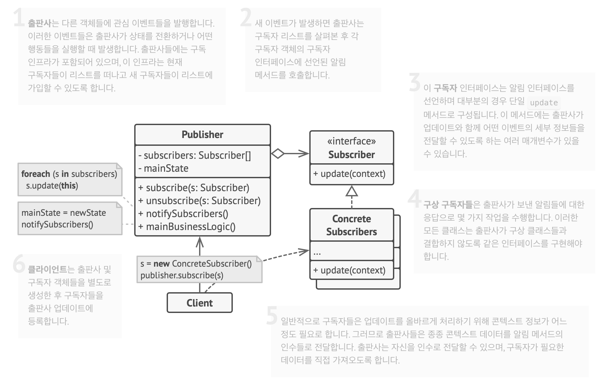
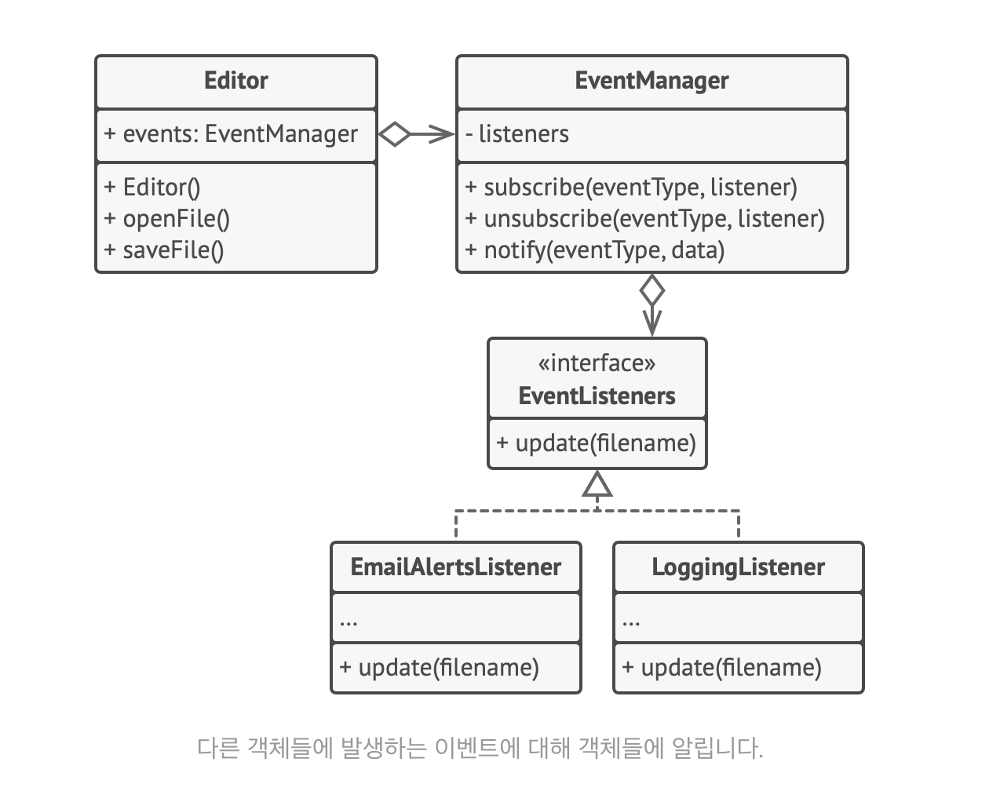

# 옵서버 패턴

여러 객체에 자신이 관찰 중인 객체에 발생하는 모든 이벤트에 대하여 알리는 구독 메커니즘

다른 객체들과의 클래스들과 결합하지 않고 해당 객체들에서 발생하는 이벤트들에 반응하는 방법 제공

시간이 지나면 변경될 수 있는 중요한 상태를 가진 객체
이 객체는 종종 주제(subject)라고 불림
이 객체는 다른 객체들에 알림을 보내는 역할도 맡음
구독 메커니즘을 통해 개별 객체들이 이벤트 알림을 구독할 수 있음
이벤트 발생할 때마다 구독자 리스트 참조 -> 그들의 객체들에 있는 특정 알림 메서드를 호출

같은 출판사 클래스 이벤트들을 추적하는데 관심이 있는 수십 개의 서로 다른 구독자 클래스들 존재

모든 구독자가 같은 인터페이스를 구현, 출판사가 오직 그 인터페이스를 통해서만 구독자들과 통신

인터페이스는 출판사가 알림과 어떤 컨텍스트 데이터를 전달하는데 사용할 수 있는 매개변수들의 집합과 알림 메서드 선언

출판사는 특정 알림 메서드를 구독자들의 객체들에서부터 호출하여 그들에게 알림을 보냄

모든 출판사가 같은 인터페이스를 따르도록 한다. 이 인터페이스는 몇 가지 구독 메서드들만 설명하면 된다.
인터페이스를 통해 구독자들은 출판자들의 상태들을 그들의 구상 클래스들과 결합하지 않고 관찰할 수 있다.

핵심은 출판사가 구독자에게 직접 간다!

## 구조

### 출판사는 다른 객체들에 관심 이벤트들을 발행한다

- 이벤트들은 출판사가 상태를 전환하거나 어떤 행동들을 실행할 때 발생
- 이 인프라는 현재 구독자들이 리스트를 떠나고 새 구독자들이 리스트에 가입할 수 있도록 기능

### 새 이벤트가 발생하면 출판사는 구독자 리스트를 살펴본 후 각 구독자 객체의 구독자 인터페이스에 선언된 알림 메서드를 호출한다

### 구독자 인터페이스는 알림 인터페이스를 선언하며 대부분의 경우 단일 `update` 메서드로 구성된다

- 이 메서드에는 출판사가 업데이트와 함께 어떤 이벤트의 세부 정보들을 전달할 수 있도록 하는 여러 매개변수 존재

### 구상 구독자들은 출판사가 보낸 알림들에 대한 응답으로 몇 가지 작업을 수행한다

- 출판사가 구상 클래스들과 결합하지 않도록 같은 인터페이스를 구현

### 일반적으로 구독자들은 업데이트를 올바르게 처리하기 위해 컨텍스트 정보가 어느 정도로 필요하다

- 출판사들은 종종 컨텍스트 데이터를 알림 메서드의 인수들로 전달
- 출판사는 자신을 인수로 전달할 수 있으며 구독자가 필요한 데이터를 직접 가져오도록 하는 것이 가능

## 의사코드

## 개념적 예시

- 패턴은 어떤 클래스들로 구성되어 있나요?
- 이 클래스들은 어떤 역할을 하나요?
- 패턴의 요소들은 어떻게 서로 연관되어 있나요?
