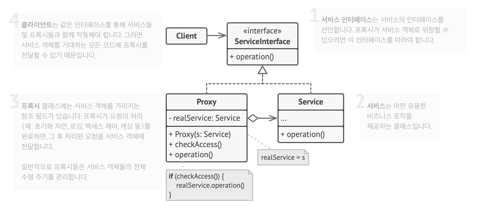

# 프록시 패턴

## 의도

프록시는 다른 객체에 대한 대체 또는 자리표시자를 제공할 수 있는 구조 디자인 패턴이다.
원래 객체에 대한 접근을 제어하므로, 요청이 원래 객체에 도달되기 전 또는 후에 무언가를 수행할 수 있도록 해준다.

프록시 패턴은 원래 서비스 객체와 같은 인터페이스로 새 프록시 클래스를 생성하라고 제안한다.
프록시 객체를 원래 객체의 모든 클라이언트에 전달하도록 앱을 업데이트할 수 있다.
클라이언트로부터 요청을 받으면 이 프록시는 실제 서비스 객체를 생성하고 모든 작업을 객체에 위임한다.

## 구조

### 서비스 인터페이스는 서비스의 인터페이스를 선언한다

- 프록시가 서비스 객체로 위장할 수 있으려면 이 인터페이스를 따라야 한다.

### 서비스는 어떤 유용한 비즈니스 로직을 제공하는 클래스이다

### 프록시 클래스에는 서비스 객체를 가리키는 참조 필드가 있다

- 프록시가 요청의 처리를 완료하면, 그 후 처리된 요청을 서비스 객체에 전달한다.
- 일반적으로 프록시들은 서비스 객체들의 객체 수명 주기를 관리한다.

### 클라이언트는 같은 인터페이스를 통해 서비스들 및 프록시들과 함께 작동해야 한다

- 서비스 객체를 기대하는 모든 코드에 프록시를 전달할 수 있다.
