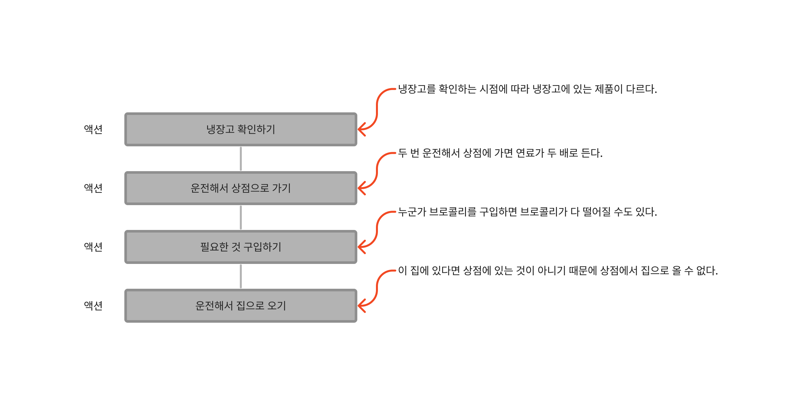
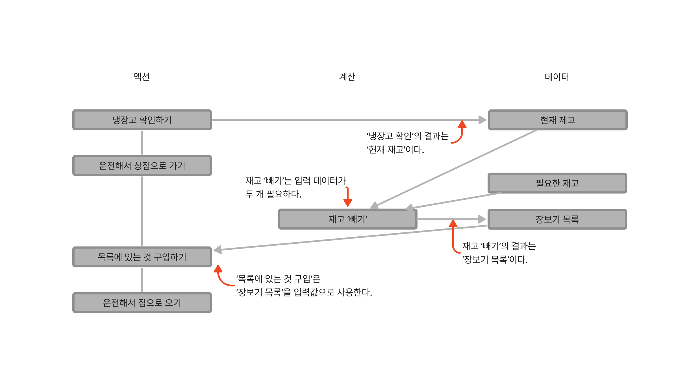

# 액션과 계산, 데이터의 차이를 알기

- 액션과 계산, 데이터가 어떻게 다른지 배운다.
- 문제에 대해 생각하거나 코드를 작성할 때 또는 코드를 읽을 때 액션과 계산, 데이터를 구분해서 적용해본다.
- 액션이 코드 전체로 퍼질 수 있다는 것을 이해한다.
- 이미 있는 코드에서 어떤 부분이 액션인지 찾아본다.

## 액션과 계산, 데이터는 어디에나 적용할 수 있습니다

장보기 과정을 알아보자.



언뜻 보면 모든 것이 액션으로 여겨질 수 있다.
모든 것이 액션이라면 뭔가 놓치고 있는 것이다.

계산과 데이터를 찾아내자.



이처럼 액션과 계산, 데이터를 더 많이 찾을 수 있고 풍부한 모델을 만들 수 있다.

장보기 과정에서 배운 것을 정리하면 다음과 같다.

### 1. 액션과 계산, 데이터는 어디에나 적용할 수 있다

### 2. 액션 안에는 계산과 데이터, 또 다른 액션이 숨어 있을지도 모른다

액션을 더 작은 액션과 계산, 데이터로 나누고 나누는 것을 언제 멈춰야 할 지 아는 것이 중요하다.

### 3. 계산은 더 작은 계산과 데이터로 나누고 연결할 수 있다

### 4. 데이터는 데이터만 조합할 수 있다

데이터는 다른 영향을 주지 않는 그냥 데이터다.
그래서 데이터를 먼저 찾아야 한다.
데이터를 찾았다면 동작에 대해 많은 것을 알 수 있다.

### 5. 계산은 때로 '우리 머릿속에서' 일어난다

계산은 우리 사고 과정에 녹아 있어서 잘 보이지 않는다.
반대로 이를 알고 잘 활용하면 계산을 더 쉽게 찾을 수 있다.
결정과 계획은 계산이 될 가능성이 높기 때문에 스스로에게 물어본다.

## 액션은 코드 전체로 퍼집니다

액션은 사용하기 참 어렵다.
액션을 부르는 함수가 있다면 그 함수도 액션이 된다.
또 그 함수를 부르는 다른 함수도 역시 액션이 되어 작은 액션 하나가 코드 전체로 퍼져 나간다.

## 액션은 다양한 형태로 나타납니다

### 함수 호출

```js
alert('Hello world') // 팝업 창이 뜨는 것은 액션이다.
```

### 메서드 호출

```js
console.log('hello') // 콘솔에 출력한다.
```

### 생성자

```js
new Date() // 기본적으로 부르는 시점에 현재 날짜와 시간을 초기화하기 때문에 호출되는 시점에 따라 다른 값을 가진다.
```

### 표현식

```js
x // 변수 참조 - y가 공유되고 변경 가능한 변수라면 읽는 시점에 따라 값이 다를 수 있다.

user.first_name // 속성 참조 - user가 공유되고 변경 가능한 객체라면 first_name은 읽는 시점에 따라 값이 다를 수 있다.

stack[0] // 배열 참조 - stack이 공유되고 변경 가능한 배열이라면 첫 번째 항목은 읽는 시점에 따라 값이 다를 수 있다.
```

### 상태

```js
z = 3 // 값 할당 - 공유하기 위해 값을 할당했고 변경 가능한 변수라면 다른 코드에 영향을 주기 때문에 액션이다.

delete user.first_name // 속성을 지우는 것은 다른 코드에 영향을 주기 때문에 액션이다.
```

이것은 모두 액션이다.
언제 부르는지 또는 얼마나 부르는지에 따라 다른 결과를 낼 수 있다.
어느 곳에서나 사용할 수 있기 때문에 코드 전체로 퍼지기 쉽다.

액션을 찾기 위해서는 코드가 호출 시점이나 횟수에 의존하는지 생각하면 된다.

## 데이터에 대해 자세히 알아보기

> 데이터를 언제나 쉽게 해석할 수 있도록 표현하는 것이 함수형 프로그램에서 중요한 기술이다.

### 데이터는 무엇인가요?

데이터는 **이벤트에 대한 사실**이다.
일어난 일의 결과를 기록한 것이다.

### 데이터의 장접은 무엇인가요?

역설적으로 데이터는 데이터 자체로 할 수 있는 것이 없기 때문에 좋다.
그래서 데이터는 데이터 그대로 이해할 수 있다.

1. 직렬화: 직렬화된 데이터는 전송하거나 디스크에 저장했다가 읽기 쉽다.

2. 동일성 비교: 데이터는 비교하기 쉽다.

3. 자유로운 해석: 데이터는 여러 가지 방법으로 해석할 수 있다.

### 어떻게 데이터에 의미를 담을 수 있나요?

데이터 구조로 의미를 담을 수 있다.

### 불변성

1. 카피-온-라이트: 변경할 때 복사본을 만든다.

2. 방어적 복사: 보관하려고 하는 데이터의 복사본을 만든다.

### 데이터의 단점은 무엇인가요?

해석이 반드시 필요하다는 점이 단점이다.
해석하지 않은 데이터는 쓸모없는 바이트일 뿐이다.

## 계산에 대해 자세히 알아보기

> 함수형 프로그래밍의 대부분은 계산을 가지고 하는 일이다.
> 계산은 일반적으로 함수형 프로그래밍 외부에 있는 액션을 통해 수행된다.

### 계산은 무엇인가요?

계산은 **입력값으로 출력값을 만드는 것**이다.
실행 시점과 횟수에 관계없이 항상 같은 입력값에 대해 같은 출력값을 돌려준다.

### 계산은 어떻게 구현하나요?

계산은 함수로 구현한다.

### 계산을 쓰면서 걱정하지 않아도 되는 것

1. 동시에 실행되는 것
2. 과거에 실행되었던 것이나 미래에 실행할 것
3. 실행 횟수

### 어떻게 계산에 의미를 담을 수 있나요?

계산에는 연산을 담을 수 있다.

### 왜 액션보다 계산이 좋나요?

1. 테스트하기 쉽다.

2. 기계적인 분석이 쉽다.

3. 조합하기 좋다.

### 계산의 단점

실행하기 전에 어떤 일이 발생할 지 알 수 없다.

## 액션에 대해 자세히 알아보기

> 액션은 함수형 프로그래밍에서 가장 중요하다.

### 액션은 무엇입니까?

액션은 **외부 세계에 영향을 주거나 받는 것**을 말한다.
액션은 **실행 시점과 횟수에 의존**한다.

- 언제 실행되는지 - 순서
- 얼마나 실행되는지 - 반복

### 액션은 쉽지 않다

1. 가능한 액션을 적게 사용한다.

2. 액션은 가능한 작게 만든다.

3. 액션이 외부 세계와 상호작용하는 것을 제한할 수 있다.

4. 액션이 호출 시점에 의존하는 것을 제한한다.

### 액션은 어떻게 구현하나요?

함수로 구현한다.
계산도 함수로 구현하기 때문에 구분하기 쉽지 않다.

### 어떻게 액션에 의미를 담을 수 있나요?

액션으로 외부 세상에 영향을 줄 수 있다.
따라서 어떤 일을 하려는지 아는 것이 중요하다.
