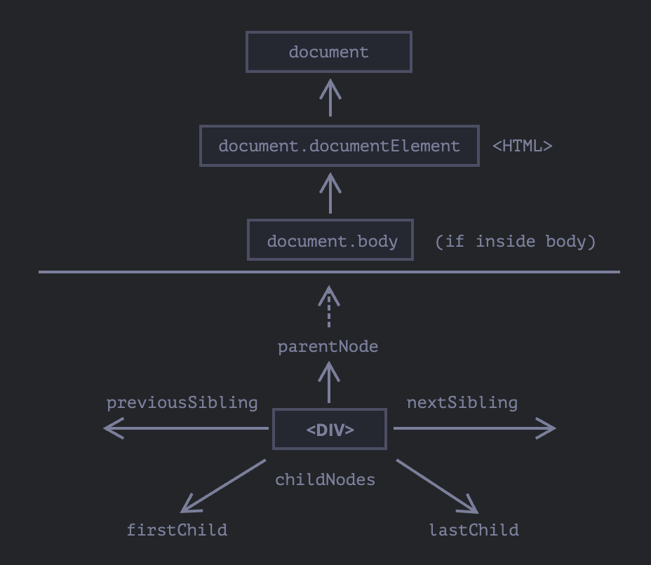
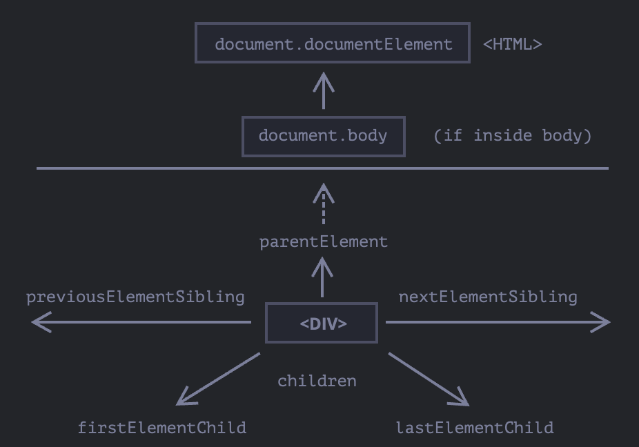

# 브라우저

## 브라우저 환경과 다양한 명세서

- 호스트(host): 자바스크립트가 돌아가는 플랫폼. ex) 브라우저, 웹서버, 커피 머신(?)...
- 호스트 환경: 각 플랫폼은 해당 플랫폼에 특정되는 기능 제공

호스트 환경이 웹 브라우저일 때 최상단에는 `window`라 불리는 **루트** 객체 존재

`window` 객체 역할

1. 자바스크립트 코드의 전역 객체
2. `브라우저 창`을 대변, 이를 제어할 수 있는 메서드 제공

### 문서 객체 모델 (DOM, Document Object Model)

- 웹 페이지 내의 모든 컨텐츠를 수정 가능한 객체로 나타냄

> **DOM은 브라우저만을 위한 모델이 아니다.**
>
> 서버 사이드 스크립트에서도 DOM을 사용할 수 있다.

> **스타일링을 위한 CSSOM**
>
> CSS 규칙과 스타일시트는 HTML과 다른 구조를 띤다.
> CSS 규칙과 스타일시트를 객체로 나타내고 이 객체를 어떻게 읽고 쓸 수 있을지에 대한 설명을 담은 명세서, CSS 객체 모델이 존재한다.
>
> CSS 규칙은 대부분 정적이기 때문에 자주 접하지는 않지만,
> 자바스크립트를 이용해 CSS 규칙을 추가 혹은 제거할 때 사용된다.

### 브라우저 객체 모델 (BOM, Browser Object Model)

- 문서 이외의 모든 것을 제어하기 위해 브라우저가 제공하는 추가 객체. ex) `navigation`, `location`, `alert`, ...

> **다양한 명세**
>
> BOM은 HTML 명세서의 일부

## DOM 트리

- HTML을 지탱하는 것은 태그
- 태그 하나가 감싸고 있는 '자식' 태그는 중첩 태그
- 태그 내의 문자 역시 객체

**루트 노드**

**텍스트 노드**

- 새 줄(newline)
- 공백(space)
- 두 가지 예외
  - `head` 이전의 공백과 새 줄은 무시
  - 모든 컨텐츠는 `body` 내부에 존재, `body` 뒤에 무언가를 넣어도 자동으로 `body` 안쪽으로 이동. 따라서 `body` 뒤에 공백x

> **문자열 양 끝 공백과 공백만 있는 텍스트 노드는 개발자 도구에서 보이지 않는다.**

### 자동 교정

- `html`, `body`, 닫는 태그, `tbody`, ...

### 기타 노드 타입

- 주석도 노드 (`HTML`에 뭔가 있다면 반드시 DOM 트리에 추가해야 한다는 규칙)
- `<!DOCTYPE>` 지시자 또한 DOM 노드
- 문서 전체를 나타내는 `document` 객체 또한 노드
- 노드 타입은 총 열두 가지, 주로 네 가지 노드 다룸
  - DOM의 '진입점'이 되는 문서 노드 (document node)
  - HTML 태그에서 만들어지며, DOM 트리를 구성하는 블록인 요소 노드 (element node)
  - 텍스트를 포함하는 텍스트 노드 (text node)
  - 화면에 보이지는 않지만, 정보를 기록하고 자바스크립트를 사용해 정보를 DOM으로부터 읽을 수 있는 주석 노드 (comment node)

### DOM 탐색하기



- `<html>` = `documentElement`와 `body`
- `<body>` = `document.body`
- `<head>` = `document.head`

> DOM에서 `null`은 '존재하지 않음'을 의미

### childNodes, firstChild, lastChild로 자식 노드 탐색하기

- 자식 노드(child node): 바로 아래의 자식 요소. 부모 노드의 바로 아래에서 중첩 관계 생성
- 후손 노드(descendants node): 중첩 관계에 있는 모든 요소 의미

**DOM 컬렉션**

`childNodes`는 배열이 아닌 반복 가능한(iterable) 유사 배열 객체인 컬렉션

> **DOM 컬렉션은 읽는 것만 가능하다.**
>
> `childNodes[i] = ...`를 이용해 자식 노드를 교체하는 것은 불가능

> **DOM 컬렉션은 살아있다.**

- DOM의 현재 상태를 반영

### 형제와 부모 노드

- `nextSibling`: 다음 형제 노드
- `previousSibling`: 이전 형제 노드
- `parentNode`: 부모 노드

### 요소 간 이동

- `childNodes`를 이용하면 텍스트 노드, 요소 노드, 주석 노드까지 참조
- 주로 웹 페이지를 구성하는 태그인 요소 노드를 조작하는 작업이 대다수



**부모가 요소 노드가 아니면?**

`<html>`에 해당하는 `document.documentElement`의 부모는 `document`이지만,
`document`는 요소 노드가 아니다.

```js
alert(document.documentElement.parentNode) // document
alert(document.documentElement.parentElement) // null
```
