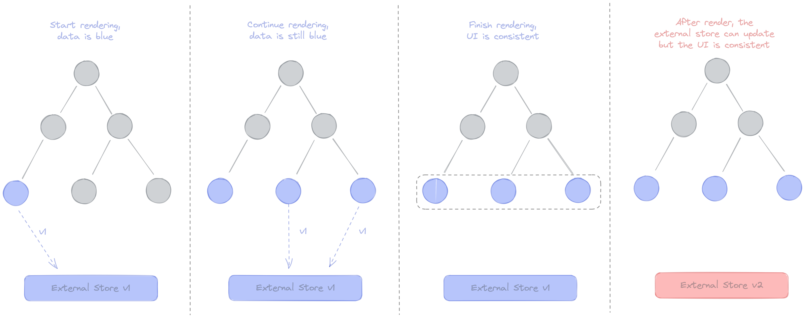
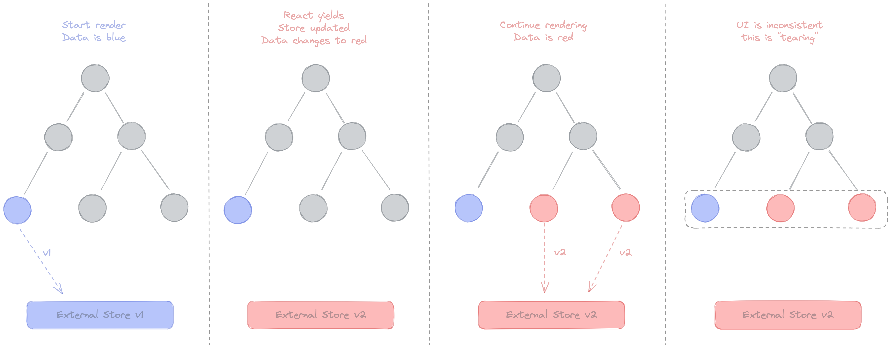

# 마이크로 상태 관리 1

## 내용 정리

<details>
<summary>마이크로 상태 관리 이해하기</summary>

## 마이크로 상태 관리 이해하기

- 리액트에서 상태는 **사용자 인터페이스를 나타내는 모든 데이터**
- 리액트 훅은 **다양한 상태를 각기 특정한 방법으로 처리하는 방향**으로 만들어짐
  - 폼 상태
  - 서버 캐시 상태
  - 내비게이션 상태
- 목적 지향적인 방법으로 처리할 수 없는 상태도 존재
  - 여전히 **범용적인 상태 관리** 필요
- 범용적이며 가벼운 상태관리를 가리켜 마이크로 상태 관리
  - 필수 기능
    - 상태 읽기
    - 상태 갱신
    - 상태 기반 렌더링
  - 추가 기능
    - 리렌더링 최적화
    - 다른 시스템과의 상호 작용
    - 비동기 지원
    - 파생 상태
    - 간단한 문법 등

## 리액트 훅 사용하기

- 상태 관리 방법을 구현하기 위한 몇 가지 기본 리액트 훅
  - `useState`
  - `useReducer`
  - `useEffect`
- 리액트 훅이 참신한 이유는 UI 컴포넌트에서 로직을 추출할 수 있기 때문

### 데이터 불러오기를 위한 서스펜스와 동시성 렌더링

- 데이터 불러오기를 위한 서스펜스
  - 비동기 처리에 대한 걱정없이 컴포넌트 코딩
- 동시성 렌더링
  - 렌더링 프로세스를 청크 단위로 분할
  - 중앙 처리 장치(CPU)가 장시간 차단되는 것을 방지
- <https://github.com/reactwg/react-18/discussions>

## 전역 상태 탐구하기

- 지역 상태
  - 컴포넌트에서 정의되고 컴포넌트 트리 내에서 사용되는 상태
- 전역 상태
  - 애플리케이션 내 서로 멀리 떨어져 있는 여러 컴포넌트에서 사용되는 상태
  - 반드시 싱글턴일 필요는 없어 전역 상태를 **공유 상태**라 부리기도 함
- 리액트는 컴포넌트 모델에 기반하기 때문에 전역 상태를 구현하는 것은 어려운 작업
  - 컴포넌트 모델에서는 **지역성**이 중요
  - **컴포넌트가 서로 격리되어야 하고 재사용이 가능**해야 한다는 것을 의미

## useState 사용하기

- 값으로 상태 갱신하기
- 함수로 상태 갱신하기
- 지연 초기화

## useReducer 사용하기

- 훅 외부에서 리듀서 함수를 정의
  - 코드 분리
  - 테스트 용이성

## useState와 useReducer의 유사점과 차이점

- `useReducer` 를 이용한 `useState` 구현
- 100% 가능

```tsx
const useState = (initialState) => {
 const [state, dispatch] = useReducer(
  (prev, action) =>
   typeof action === 'function' ? action(prev) action : action, initialState
 )
 return [state, dispatch]
}
```

- `useState` 를 이용한 `useReducer` 구현
- 거의 가능

```tsx
const useReducer = (reducer, initialState) => {
 const [state, setState] = useState(
  init ? () => init(initialArg) : initialArg

 const dispatch = useCallback(
  (action) => setState(prev => reducer(prev, action)),
  [reducer]
 )

 return [state, dispatch]
}
```

### 초기화 함수 사용하기

### 인라인 리듀서 사용하기

</details>

<details>
<summary>지역 상태와 전역 상태 사용하기</summary>

## 지역 상태와 전역 상태 사용하기

- 순수 함수는 오직 **인수에만 의존**
  - 동일한 인수를 받은 경우 동일한 값 반환
- 상태는 **인수 외부의 값**
  - 상태에 의존하는 함수는 비순수 함수
- 상태가 컴포넌트에 내에서만 사용되면 다른 컴포넌트에 영향을 미치지 않음
  - **억제됨**(contained)으로 표현
- 싱글턴은 코드 재사용성이 떨어짐
- 컨테이너 객체를 만드는 것이 더 모듈화된 접근 방식

```tsx
const createContainer = () => {
  let base = 1
  const addBase = (n) => n + base
  const changeBase = (b) => {
    base = b
  }
  return { addBase, changeBase }
}

const { addBase, changeBase } = createContainer()
```

- 리액트는 개념적으로 **상태를 사용자 인터페이스(UI)로 변환하는 함수**

## 지역 상태를 효과적으로 사용하는 방법

- 상태 끌어올리기: 상위 컴포넌트 트리에서 상태를 정의
  - 일부 상황에서 성능 문제
- 내용 끌어올리기: 상위 컴포넌트에서 내용 정의

### 전역 상태 사용하기

- 상태가 하나의 컴포넌트에만 속하지 않고 여러 컴포넌트에서 사용할 수 있다면 전역 상태
- 전역 상태에 대해 이야기할 때 두 가지 측면
  - 싱글턴, 특정 컨텍스트에서 상태가 하나의 값을 가지고 있다는 것
  - 공유 상태, 상태 값이 다른 컴포넌트 간에 공유된다는 것, 자바스크립트 메모리상에서 단일 값일 필요는 없음
- 두 가지 상황에서 전역 상태 사용
  - prop을 전달하는 것이 적절하지 않을 때
  - 이미 리액트 외부에 상태가 있을 때

</details>

## reducer 공부하기

- [Extracting State Logic into a Reducer](https://react.dev/learn/extracting-state-logic-into-a-reducer)

Because the reducer function takes state (tasks) as an argument, you can declare it outside of your component.

## React 18 알파 동시성 렌더링으로 전역 상태 라이브러리 테스트하기

[Testing Global State Libraries With React 18 Alpha Concurrent Rendering](https://blog.axlight.com/posts/testing-global-state-libraries-with-react-18-alpha-concurrent-rendering/)

동시성 모드에서의 전역 상태 라이브러리 테스트

[What is "Tearing" in the context of the React-Redux?](https://stackoverflow.com/questions/54891675/what-is-tearing-in-the-context-of-the-react-redux)

동시성 모드에서 React는 트리를 통한 렌더링 과정을 중단하면서 나중에 트리의 나머지 계산을 시작할 수 있다.

- 트리의 컴포넌트가 외부 값을 읽고 있는 상황에서 렌더링이 중단된 상태에서 해당 값이 변경
- 일부 상위 컴포넌트(upper component)는 1을 사용하여 렌더링
- 일부 하위 컴포넌트(later component)는 2를 사용하여 렌더링
- 트리의 다른 부분이 같은 렌더링 과정에서 서로 다른 값을 기반으로 동작을 결정
- 렌더링 결과가 일관되지 않게 되는 현상 (tearing)

### tearing

- 두 컴포넌트가 같은 전역 상태에 대해 서로 다른 값으로 렌더링하는 바람직하지 않는 동작

[What is tearing?](https://github.com/reactwg/react-18/discussions/69)

#### 동기식 렌더링



#### 동시성 렌더링



### branching

- 컴포넌트가 전이(transition) 업데이트에서 상태의 오래된 값으로 렌더링하는 바람직한 동작

## useSyncExternalStore

### time slicing

## tearing보다 중요한 것

[Why useSyncExternalStore Is Not Used in Jotai](https://blog.axlight.com/posts/why-use-sync-external-store-is-not-used-in-jotai/)

### jotai

> Jotai is modeled after useState and we expect useTransition to behave likewise.
> This is more important than temporary tearing.

- [zustand에서 동시성 렌더링가 제대로 동작하지 않는 예제 코드](https://codesandbox.io/p/sandbox/zustand-suspense-demo-forked-9ss9r6?)
- [use-zustand](https://github.com/zustandjs/use-zustand)

#### 무엇이 다른가?

- `Zustand`에는 `vanilla store`와 함께 사용할 수 있는 `useStore` 훅이 존재
- `useStore`는 "external stores"를 사용하는 권장된 방식인 `useSyncExternalStore`로 구현, 이는 tearing 문제 해결
- 하지만 "Sync" 동작은 **동시성 렌더링에서 제대로 동작하지 않음**
  - `startTransition`를 예상대로 사용할 수 없음
- `useZustand`는 `useSyncExternalStore`를 사용하지 않고 `useReducer`와 `useEffect`만 사용
  - tearing이 발생하지만 **동시성 렌더링에서 제대로 동작**

## 기타 문서

- [Concurrent React for Library Maintainers](https://github.com/reactwg/react-18/discussions/70)
- [React 상태 관리 라이브러리 Zustand의 코드를 파헤쳐보자](https://ui.toast.com/weekly-pick/ko_20210812)
