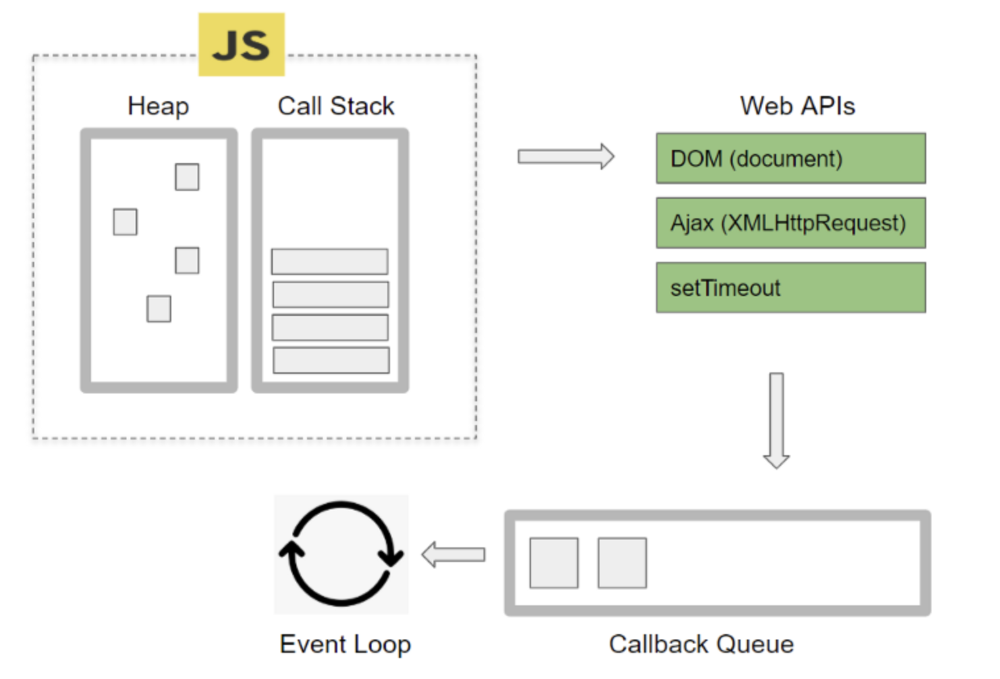

# 이벤트 루프에 대해 설명해주세요

자바스크립트는 **싱글 스레드 언어**이다.
이에 한 번에 하나의 작업만 수행 가능하다.

그런데 웹에서는 네트워크 요청, 이벤트 처리와 같이 멀티로 이루어져야 하는 작업이 많다.

여기서 싱글 스레드로 하나씩 수행되면 대기하는 시간이 많아진다.

따라서 이러한 작업들은 자바스크립트 엔진이 아닌 **브라우저 내부의 멀티 스레디인 Web APIs에서 비동기 + 논블로킹으로 처리**된다.

브라우저의 동작 타이밍을 제어하는 관리자로 볼 수 있다.

비동기 자바스크립트 코드를 브라우저 Web APIs에 맡긴다.
ex) `setTimeout`, `fetch`

이벤트 루프를 이용한 프로그램 방식을 이벤트 기반 프로그래밍이라 한다.
이를 통해 단순하고 직관적인 코드 작성을 가능하게 해준다.

## 브라우저 내부 구성도

- Call Stack: 코드 실행을 위해 사용하는 메모리 구조이다.
- Heap: 동적으로 생성된 자바스크립트 객체가 저장되는 공간이다.
- Web APIs: 브라우저에서 제공하는 API 모음으로, 비동기적으로 실행되는 작업들을 전담하여 처리한다.
  - 각 API마다 스레드들이 할당되어 있고 이들이 모여 멀티 스레드로 이루어진다.
  - ex)`setTimeout`은 타이머 스레드, `XMLHttpRequest`, `fetch`는 네트워크 스레드
  - 모든 Web API가 비동기로 동작하는 것은 아니다.
  - ex) DOM API와 Console API는 동기적으로 처리
- Callback Queue: 비동기적 작업이 완료되면 실행되는 함수들이 대기하는 공간이다.

## Callback Queue의 종류

- Task Queue: `setTimeout`, `setInterval`, `fetch`, `addEventListener`와 같이 비동기로 처리되는 함수
- Microtask Queue: 가장 우선순위가 높다. `promise`, `process.nextTick`, `MutationObserver`가 해당된다.
- Animation Frames Queue: requestAnimationFrame와 같이 브라우저 렌더링과 관련, Task Queue보다 우선순위가 높다.

### GPT로 문장 정리하기

> 자바스크립트에서의 이벤트 루프에 대해 설명해줘.

- 비동기적인 코드 실행을 관리하는 핵심 메커니즘 중 하나이다.
- JavaScript는 싱글 스레드 언어로, 하나의 메인 실행 스레드에서 코드를 처리한다.
- 이로 인해 긴 작업이나 블로킹 작업이 발생할 경우 전체 애플리케이션 성능이 저하될 수 있다.
- 이를 해결하기 위해 이벤트 루프를 사용한다.
- 이벤트 루프는 콜 스택이 비어 있으면 실행된다.

### 키워드 정리

- 자바스크립트에서의 비동기 처리
- Callback Queue
  - Task Queue
  - MicroTask Queue
  - Animation Frames Queue

### 참고 자료

- [🔄 자바스크립트 이벤트 루프 동작 구조 & 원리 끝판왕](https://inpa.tistory.com/entry/%F0%9F%94%84-%EC%9E%90%EB%B0%94%EC%8A%A4%ED%81%AC%EB%A6%BD%ED%8A%B8-%EC%9D%B4%EB%B2%A4%ED%8A%B8-%EB%A3%A8%ED%94%84-%EA%B5%AC%EC%A1%B0-%EB%8F%99%EC%9E%91-%EC%9B%90%EB%A6%AC)
